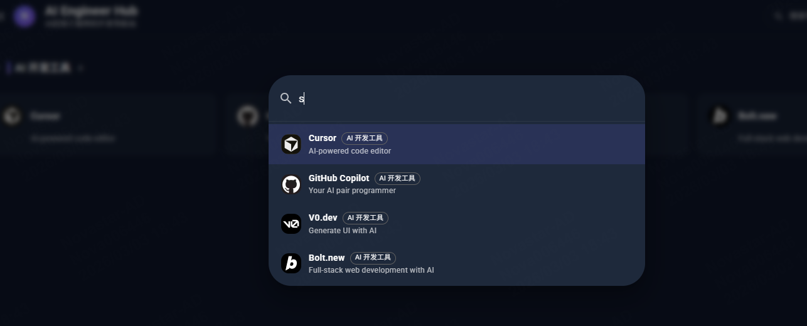
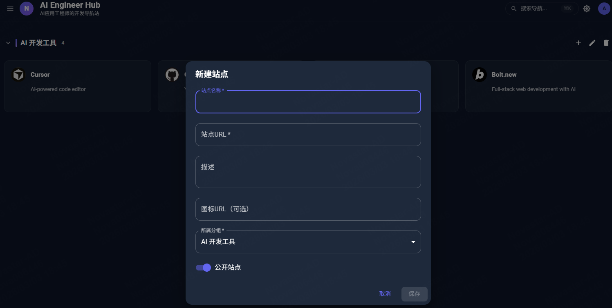
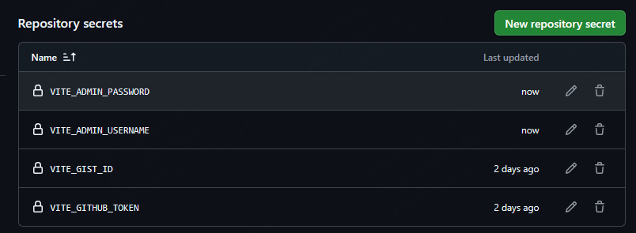

# NavGate

现代化个人网站导航管理系统，支持多种部署模式：GitHub Pages（localStorage）、GitHub Gist 同步和 Docker 容器化部署。

## 项目预览








## 项目特点

- **多部署模式**：支持本地存储、GitHub Gist 同步和 Docker 后端部署
- **响应式设计**：完美适配不同屏幕尺寸，支持移动端
- **拖拽排序**：直观的分组和站点拖拽排序功能
- **搜索功能**：快速搜索导航站点，支持快捷键
- **主题切换**：支持浅色/深色模式，跟随系统偏好
- **备案信息**：灵活的 ICP 备案号、公安备案号配置
- **数据导出**：支持 JSON 格式数据导入导出

## 部署方式

### 1. GitHub Pages 部署（默认模式）

**特点**：

- 零服务器成本，完全免费
- 数据存储在浏览器 localStorage
- 适合个人使用，无需同步需求

**部署步骤**：

1. Fork 本项目到您的 GitHub 账号
2. 在 GitHub 设置中启用 GitHub Pages
3. 选择 `apps/frontend` 目录作为发布源
4. 访问 `https://your-username.github.io/NavGate`

### 2. GitHub Gist 同步部署

**特点**：

- 跨设备数据同步
- 数据安全存储在 GitHub
- 支持多设备管理

**配置步骤**：

1. 在 GitHub 上创建一个新的 Gist（gist.github.com）
2. 生成具有 `gist` 权限的 GitHub Token（github.com/settings/tokens）
3. 在应用中设置以下环境变量：
   ```bash
   VITE_DEPLOY_MODE=gist
   VITE_GIST_ID=your_gist_id
   VITE_GITHUB_TOKEN=your_github_token
   VITE_ADMIN_USERNAME=your_username
   VITE_ADMIN_PASSWORD=your_password
   ```

### 3. Docker 部署（推荐）

**特点**：

- 完整的后端 API 服务
- JSON 文件持久化存储
- 支持环境变量配置
- 易于部署和管理

**快速启动**：

```bash
# 构建镜像
docker build -t navgate:latest .

# 运行容器
docker run -d \
  --name navgate \
  -p 3456:3456 \
  -v /path/to/data:/app/data \
  -e AUTH_USERNAME=admin \
  -e AUTH_PASSWORD=admin123 \
  --restart=unless-stopped \
  navgate:latest
```

**配置选项**：

```bash
docker run -d \
  --name navgate \
  -p 3456:3456 \
  -v /www/wwwroot/NavGate/data:/app/data \
  --restart=unless-stopped \
  -e AUTH_USERNAME=your_username \
  -e AUTH_PASSWORD=your_password \
  -e ICP_NUMBER="您的ICP备案号" \
  -e POLICE_NUMBER="您的公安备案号" \
  -e COPYRIGHT="© 2024 您的公司名称" \
  navgate:latest
```

**访问地址**：

- 前端应用：http://localhost:3456
- API 接口：http://localhost:3456/api
- 健康检查：http://localhost:3456/health

### 4. 宝塔面板部署

**部署步骤**：

1. **域名解析**：
   - 添加 A 记录指向服务器 IP
   - 配置 www 子域名（可选）

2. **反向代理配置**：
   - 在宝塔面板创建网站
   - 设置反向代理到 `http://127.0.0.1:3456`
   - 申请 Let's Encrypt 免费 SSL 证书

3. **启动容器**：
   ```bash
   docker run -d \
     --name navgate \
     -p 3456:3456 \
     -v /www/wwwroot/NavGate/data:/app/data \
     -e AUTH_USERNAME=your_username \
     -e AUTH_PASSWORD=your_password \
     -e ICP_NUMBER="您的ICP备案号" \
     -e COPYRIGHT="© 2024 您的公司名称" \
     --restart=unless-stopped \
     navgate:latest
   ```

详细配置说明请参考 [宝塔面板部署指南](#宝塔面板部署指南)

## 备案信息配置

NavGate 支持灵活的备案信息配置，不会在代码中硬编码备案号。

### 配置方式

**Docker 部署**：

```bash
docker run -d \
  --name navgate \
  -p 3456:3456 \
  -e ICP_NUMBER="京ICP备12345678号-1" \
  -e POLICE_NUMBER="京公网安备 11000002000001号" \
  -e COPYRIGHT="© 2024 您的公司名称" \
  navgate:latest
```

**API 配置**：

```bash
curl -X PUT http://localhost:3456/api/config \
  -H "Content-Type: application/json" \
  -H "Authorization: Bearer YOUR_TOKEN" \
  -d '{
    "ICP_NUMBER": "您的ICP备案号",
    "POLICE_NUMBER": "您的公安备案号",
    "COPYRIGHT": "© 2024 您的公司名称"
  }'
```

详细配置说明请参考 [备案信息配置文档](FOOTER_CONFIG.md)

## 开发环境

### 安装依赖

```bash
# 使用 pnpm
pnpm install

# 或使用 npm
npm install
```

### 开发命令

```bash
# 启动前端开发服务器（localhost:5173）
pnpm dev

# 启动后端开发服务器（localhost:3000）
pnpm dev:backend

# 构建生产版本
pnpm build

# 运行类型检查
pnpm type-check

# 运行代码检查
pnpm lint

# 运行测试
pnpm test
```

### 项目结构

```
NavGate/
├── apps/
│   ├── frontend/          # React 前端应用
│   └── server/            # Express 后端 API
├── packages/
│   ├── types/             # TypeScript 类型定义
│   ├── utils/             # 工具函数
│   └── validation/        # 数据验证
├── docker/               # Docker 配置
├── scripts/              # 工具脚本
└── resource/             # 项目资源
```

## 技术栈

### 前端

- **框架**：React 19
- **UI 库**：Material UI 7.0
- **样式**：Tailwind CSS 4.1
- **构建工具**：Vite 6.2
- **状态管理**：React Hooks
- **拖拽**：@dnd-kit/core

### 后端

- **框架**：Express.js
- **存储**：JSON 文件
- **验证**：自定义验证逻辑
- **认证**：Base64 Token

### 开发工具

- **包管理**：pnpm workspace
- **代码检查**：ESLint + Prettier
- **类型检查**：TypeScript 5.7
- **Git Hooks**：Husky
- **提交规范**：Commitlint

## 环境变量

### 前端环境变量

```bash
# 部署模式：github-pages | gist | backend
VITE_DEPLOY_MODE=backend

# API 基础 URL（后端模式）
VITE_API_BASE_URL=/api

# GitHub Gist 配置（Gist 模式）
VITE_GIST_ID=your_gist_id
VITE_GITHUB_TOKEN=your_github_token

# 管理员凭证
VITE_ADMIN_USERNAME=admin
VITE_ADMIN_PASSWORD=admin123
```

### 后端环境变量

```bash
# 服务器配置
PORT=3000
NODE_ENV=production

# 认证配置
AUTH_USERNAME=admin
AUTH_PASSWORD=admin123

# 数据库配置
JSON_DB_PATH=/app/data/nav-data.json

# 备案信息配置
ICP_NUMBER=您的ICP备案号
POLICE_NUMBER=您的公安备案号
COPYRIGHT=© 2024 您的公司名称
CUSTOM_FOOTER=自定义页脚HTML
```

## 功能特性

### 用户功能

- 🔍 快速搜索导航站点（⌘K 快捷键）
- 🌗 分类管理，支持展开/收起
- 🎨 浅色/深色主题切换
- 📱 响应式设计，完美适配移动端
- 📤 数据导出为 JSON 文件
- 📥 从 JSON 文件导入数据

### 管理员功能

- 👤 安全的登录认证系统
- ➕ 创建/编辑/删除分组
- 🌐 创建/编辑/删除站点
- 🔄 拖拽排序分组和站点
- ⚙️ 站点可见性控制
- 📊 数据管理（导出/导入）
- 🔐 备案信息配置

### 系统功能

- 🏥 健康检查端点
- 🔒 简单的 Token 认证
- 📝 完整的 API 文档
- 🚀 Docker 容器化支持
- 🔧 环境变量配置

## 常见问题

### Q: 如何切换部署模式？

A: 修改 `VITE_DEPLOY_MODE` 环境变量：

- `github-pages`：使用 localStorage（默认）
- `gist`：使用 GitHub Gist 同步
- `backend`：使用 HTTP API 后端

### Q: 如何重置管理员密码？

A: 修改 Docker 容器的环境变量：

```bash
docker stop navgate
docker rm navgate
docker run -d \
  --name navgate \
  -e AUTH_USERNAME=new_username \
  -e AUTH_PASSWORD=new_password \
  navgate:latest
```

### Q: 数据存储在哪里？

A: 取决于部署模式：

- GitHub Pages：浏览器 localStorage
- Gist 模式：GitHub Gist
- Docker 模式：`/app/data/nav-data.json`

### Q: 如何备份我的数据？

A: 登录管理员账号后，点击"导出数据"按钮，数据将保存为 JSON 文件。

## 许可证

MIT License - 详见 [LICENSE](LICENSE) 文件

## 贡献

欢迎贡献代码！请遵循以下步骤：

1. Fork 本项目
2. 创建特性分支 (`git checkout -b feature/AmazingFeature`)
3. 提交更改 (`git commit -m 'feat: Add some AmazingFeature'`)
4. 推送到分支 (`git push origin feature/AmazingFeature`)
5. 提交 Pull Request

## 联系方式

- GitHub Issues：[提交问题](https://github.com/yunlongwen/NavGate/issues)
- 邮箱：您的邮箱地址

---

**NavGate** - 让个人导航更简单 ✨
